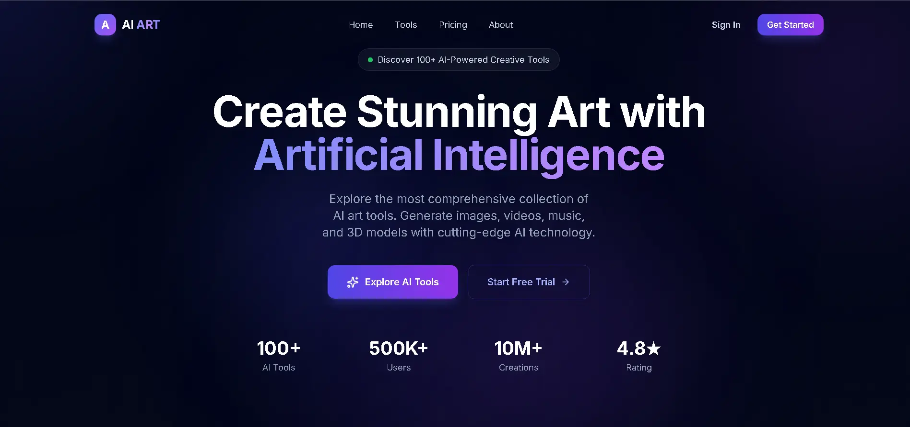

# 🎨 AI ART — AI-Powered Creative Tools Platform
   
🌟 Overview

**AI ART** is a full-stack web application that serves as a comprehensive directory and platform for AI-powered creative tools. Users can discover, explore, and use 100+ AI tools for image generation, video creation, audio production, 3D modeling, and more.

<div align="center">


[](https://nextjs.org/)
[](https://golang.org/)
[](https://www.typescriptlang.org/)
[](https://tailwindcss.com/)
[](https://www.postgresql.org/)

**The most comprehensive AI-powered creative tools platform.**  
Generate images, videos, music, and 3D models with cutting-edge AI technology.



</div>

---

## 📋 Table of Contents

- [Overview](#-overview)
- [Features](#-features)
- [Tech Stack](#-tech-stack)
- [Project Structure](#-project-structure)
- [Getting Started](#-getting-started)
- [Environment Variables](#-environment-variables)
- [API Documentation](#-api-documentation)
- [Performance](#-performance)
- [Screenshots](#-screenshots)
- [Contributing](#-contributing)
- [License](#-license)

---


### What makes AI ART special?

- 🎯 **Curated Collection** — 100+ hand-picked AI creative tools
- ⚡ **Lightning Fast** — 90+ Lighthouse performance score
- 🔒 **Secure Auth** — httpOnly cookie-based JWT authentication
- 🌈 **Premium UI** — Glassmorphism design with Blue/Purple theme
- 📱 **Fully Responsive** — Works perfectly on all devices
- ♿ **Accessible** — 96+ Lighthouse accessibility score

---

## ✨ Features

### 🎨 Frontend Features
- **AI Tools Directory** — Browse 100+ AI tools with category filters
- **Search & Filter** — Filter by category, featured, and search by name
- **Authentication** — Email/password + Google + GitHub OAuth
- **Premium UI** — Glassmorphism, gradient animations, dark theme
- **Pricing Plans** — Free, Pro, and Enterprise tiers
- **Testimonials** — User reviews and ratings
- **How It Works** — Step-by-step guide
- **Fully Animated** — Smooth scroll animations with IntersectionObserver

### ⚙️ Backend Features
- **REST API** — Complete Golang REST API with Gin framework
- **JWT Auth** — Secure httpOnly cookie-based authentication
- **OAuth 2.0** — Google and GitHub social login
- **Database** — PostgreSQL with GORM auto-migration
- **Role-Based Access** — User and Admin roles
- **CORS** — Properly configured for frontend
- **Soft Delete** — Data never permanently deleted

### 🔐 Security Features
- httpOnly cookies (XSS protected)
- Password hashing with bcrypt
- JWT token expiration
- CORS protection
- Security headers (HSTS, XFO, CSP)
- Input validation (frontend + backend)

---

## 🛠️ Tech Stack

### Frontend
| Technology | Version | Purpose |
|-----------|---------|---------|
| Next.js | 16.2.4 | React Framework |
| TypeScript | 5.0+ | Type Safety |
| Tailwind CSS | 3.4.4 | Styling |
| Lucide React | 0.468.0 | Premium Icons |
| clsx | 2.1.1 | Class Management |

### Backend
| Technology | Version | Purpose |
|-----------|---------|---------|
| Go (Golang) | 1.22+ | Backend Language |
| Gin | Latest | HTTP Framework |
| GORM | Latest | ORM |
| PostgreSQL | 18 | Database |
| JWT | v5 | Authentication |
| bcrypt | Latest | Password Hashing |
| OAuth2 | Latest | Social Login |

---

## 📁 Project Structure

```
AI-ART/
├── ai-art/                          # Next.js Frontend
│   ├── src/
│   │   ├── app/
│   │   │   ├── layout.tsx           # Root layout with AuthProvider
│   │   │   ├── page.tsx             # Home page
│   │   │   ├── globals.css          # Global styles
│   │   │   ├── signin/
│   │   │   │   └── page.tsx         # Sign In page
│   │   │   ├── signup/
│   │   │   │   └── page.tsx         # Sign Up page
│   │   │   ├── tools/
│   │   │   │   └── page.tsx         # AI Tools directory
│   │   │   ├── pricing/
│   │   │   │   └── page.tsx         # Pricing plans
│   │   │   └── about/
│   │   │       └── page.tsx         # About page
│   │   ├── components/
│   │   │   ├── Navbar.tsx           # Responsive navbar with auth state
│   │   │   ├── HeroSection.tsx      # Landing hero
│   │   │   ├── FeaturesGrid.tsx     # Features showcase
│   │   │   ├── ToolsShowcase.tsx    # Tools grid with filters
│   │   │   ├── HowItWorks.tsx       # Step-by-step guide
│   │   │   ├── Testimonials.tsx     # User reviews
│   │   │   ├── PricingSection.tsx   # Pricing plans
│   │   │   ├── StatsSection.tsx     # Statistics
│   │   │   ├── CTASection.tsx       # Call to action
│   │   │   ├── Footer.tsx           # Site footer
│   │   │   ├── LogoCloud.tsx        # Partner logos
│   │   │   └── ui/
│   │   │       ├── Button.tsx       # Reusable button
│   │   │       ├── Card.tsx         # Reusable card
│   │   │       ├── Input.tsx        # Reusable input
│   │   │       ├── PremiumIcon.tsx  # Icon wrapper
│   │   │       ├── GlowEffect.tsx   # Background glow
│   │   │       ├── GradientText.tsx # Gradient text
│   │   │       └── AnimatedSection.tsx # Scroll animations
│   │   ├── lib/
│   │   │   ├── api.ts               # API calls (no localStorage)
│   │   │   ├── auth-context.tsx     # React Auth Context
│   │   │   ├── icon-map.tsx         # Lucide icon mapping
│   │   │   └── utils.ts             # Utility functions
│   │   └── data/
│   │       └── tools.ts             # Tools data & types
│   ├── tailwind.config.js           # Tailwind configuration
│   ├── next.config.ts               # Next.js configuration
│   ├── netlify.toml                 # Netlify deployment config
│   └── package.json
│
└── ai-art-backend/                  # Golang Backend
    ├── main.go                      # Entry point
    ├── go.mod                       # Go modules
    ├── config/
    │   └── config.go                # Environment config
    ├── database/
    │   └── database.go              # DB connection & migration
    ├── models/
    │   ├── user.go                  # User model & types
    │   └── tool.go                  # Tool & Subscription models
    ├── handlers/
    │   ├── auth.go                  # Auth handlers (signup/signin)
    │   ├── oauth.go                 # Google & GitHub OAuth
    │   ├── tools.go                 # Tools CRUD handlers
    │   └── users.go                 # User profile handlers
    ├── middleware/
    │   └── auth.go                  # JWT auth middleware
    ├── routes/
    │   └── routes.go                # API routes setup
    └── utils/
        └── jwt.go                   # JWT utilities
```

---

## 🚀 Getting Started

### Prerequisites

```bash
node >= 20.0.0
go >= 1.22.0
postgresql >= 15.0
git
```

### 1. Clone the Repository

```bash
git clone https://github.com/RAO-HABIB/AI_ART_WEBSITE.git
cd AI_ART_WEBSITE
```

### 2. Frontend Setup

```bash
cd ai-art

# Install dependencies
npm install

# Create environment file
cp .env.example .env.local
# Edit .env.local with your values

# Run development server
npm run dev
```

### 3. Backend Setup

```bash
cd ai-art-backend

# Install Go dependencies
go mod tidy

# Create environment file
cp .env.example .env
# Edit .env with your values

# Run the server
go run main.go
```

### 4. Database Setup

```sql
-- Create database in PostgreSQL
CREATE DATABASE aiart_db;
-- Tables will be auto-created by GORM migrations
```

---

## 🔑 Environment Variables

### Frontend (`.env.local`)

```env
NEXT_PUBLIC_API_URL=http://localhost:8080
```

### Backend (`.env`)

```env
# Server
PORT=8080
ENV=development

# Database
DB_HOST=localhost
DB_PORT=5432
DB_USER=postgres
DB_PASSWORD=your_password
DB_NAME=aiart_db

# JWT
JWT_SECRET=your-super-secret-key
JWT_EXPIRE_HOURS=24

# Frontend URL (CORS)
FRONTEND_URL=http://localhost:3000

# Google OAuth
GOOGLE_CLIENT_ID=your-google-client-id
GOOGLE_CLIENT_SECRET=your-google-client-secret
GOOGLE_REDIRECT_URL=http://localhost:8080/api/auth/google/callback

# GitHub OAuth
GITHUB_CLIENT_ID=your-github-client-id
GITHUB_CLIENT_SECRET=your-github-client-secret
GITHUB_REDIRECT_URL=http://localhost:8080/api/auth/github/callback
```

---

## 📡 API Documentation

### Base URL
```
http://localhost:8080/api
```

### Authentication Endpoints

| Method | Endpoint | Description | Auth Required |
|--------|----------|-------------|---------------|
| `POST` | `/auth/signup` | Register new user | ❌ |
| `POST` | `/auth/signin` | Login with email | ❌ |
| `POST` | `/auth/signout` | Logout user | ✅ |
| `GET` | `/auth/me` | Get current user | ✅ |
| `GET` | `/auth/google` | Google OAuth login | ❌ |
| `GET` | `/auth/google/callback` | Google OAuth callback | ❌ |
| `GET` | `/auth/github` | GitHub OAuth login | ❌ |
| `GET` | `/auth/github/callback` | GitHub OAuth callback | ❌ |

### Tools Endpoints

| Method | Endpoint | Description | Auth Required |
|--------|----------|-------------|---------------|
| `GET` | `/tools` | Get all tools | ❌ |
| `GET` | `/tools/:id` | Get single tool | ❌ |
| `POST` | `/tools` | Create tool | ✅ Admin |
| `PUT` | `/tools/:id` | Update tool | ✅ Admin |
| `DELETE` | `/tools/:id` | Delete tool | ✅ Admin |

### User Endpoints

| Method | Endpoint | Description | Auth Required |
|--------|----------|-------------|---------------|
| `GET` | `/users/profile` | Get profile | ✅ |
| `PUT` | `/users/profile` | Update profile | ✅ |
| `GET` | `/users` | Get all users | ✅ Admin |

### Request Examples

#### Sign Up
```json
POST /api/auth/signup
{
  "first_name": "John",
  "last_name": "Doe",
  "email": "john@example.com",
  "password": "SecurePass123"
}
```

#### Sign In
```json
POST /api/auth/signin
{
  "email": "john@example.com",
  "password": "SecurePass123"
}
```

#### Get Tools with Filters
```
GET /api/tools?category=Image Generation&featured=true&search=art
```

### Response Format

```json
{
  "success": true,
  "message": "Operation successful",
  "data": { ... },
  "count": 12
}
```

---

## 📊 Performance

Lighthouse scores achieved on production build:

| Metric | Score |
|--------|-------|
| 🟢 Performance | **90+** |
| 🟢 Accessibility | **96+** |
| 🟢 Best Practices | **100** |
| 🟢 SEO | **100** |

### Core Web Vitals

| Metric | Value |
|--------|-------|
| First Contentful Paint | 0.4s |
| Largest Contentful Paint | 0.7s |
| Total Blocking Time | 250ms |
| Cumulative Layout Shift | 0 |
| Speed Index | 1.0s |

### Improvements over original template

| Metric | Original | AI ART | Improvement |
|--------|----------|--------|-------------|
| Performance | 61 | 90+ | **+47%** 🚀 |
| TBT | 1,810ms | 250ms | **7x better** |
| FCP | 0.9s | 0.4s | **2x faster** |
| CLS | 0.024 | 0 | **Perfect** |

---

## 🎨 UI Features

- **Glassmorphism** — Frosted glass card effects
- **Gradient Animations** — Smooth color transitions
- **Glow Effects** — Ambient lighting effects
- **Scroll Animations** — IntersectionObserver based
- **Premium Icons** — Lucide React SVG icons
- **Dark Theme** — Full dark mode support
- **Responsive** — Mobile-first design
- **Grid Pattern** — Subtle background texture

---

## 🔒 Security Implementation

```
✅ httpOnly Cookies      — XSS attack protection
✅ bcrypt Hashing        — Password security
✅ JWT Expiration        — Token management
✅ CORS Configuration    — Cross-origin protection
✅ Input Validation      — Frontend + Backend
✅ Soft Delete           — Data preservation
✅ Role-Based Access     — User/Admin separation
✅ Security Headers      — HSTS, XFO, CSP
```

---

## 🤝 Contributing

Contributions are welcome!

```bash
# Fork the repo
# Create feature branch
git checkout -b feature/AmazingFeature

# Commit changes
git commit -m 'Add AmazingFeature'

# Push to branch
git push origin feature/AmazingFeature

# Open Pull Request
```

---

## 📄 License

```
MIT License

Copyright (c) 2024 RAO-HABIB

Permission is hereby granted, free of charge, to any person obtaining a copy
of this software and associated documentation files (the "Software"), to deal
in the Software without restriction, including without limitation the rights
to use, copy, modify, merge, publish, distribute, sublicense, and/or sell
copies of the Software, and to permit persons to whom the Software is
furnished to do so, subject to the following conditions:

The above copyright notice and this permission notice shall be included in all
copies or substantial portions of the Software.
```

---

## 👨‍💻 Author

**RAO-HABIB**

[](https://github.com/RAO-HABIB)

---

<div align="center">

**⭐ Star this repo if you found it helpful!**

Made with ❤️ by RAO-HABIB

</div>
